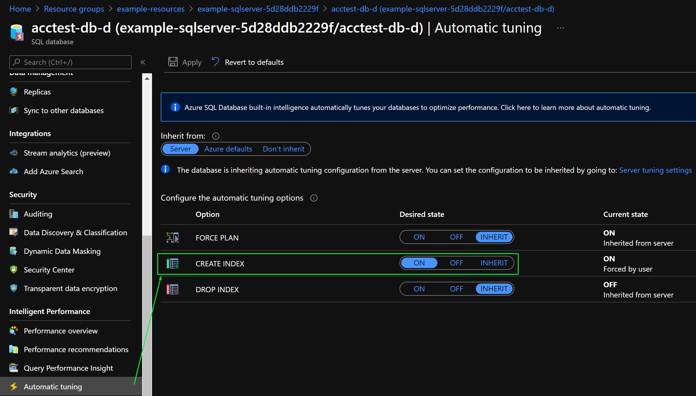

# Using Terraform to enable automatic tuning mode in an individual Azure SQL database

## Introduction

 Azure SQL Database automatically manages data services that constantly monitor your queries and identifies the action that you can perform to improve performance of your workload. You can review recommendations and manually apply them, or let Azure SQL Database automatically apply corrective actions - this is known as automatic tuning mode.

 Automatic tuning can be enabled at the server or the database level through:

- The Azure portal
- REST API calls
- T-SQL commands

> Source [official Microsoft docs](https://docs.microsoft.com/en-us/azure/azure-sql/database/automatic-tuning-enable#enable-automatic-tuning-on-an-individual-database)

## The challenge

Given the limited options to enable automatic tuning, currently **it is not possible to enable it through Azure CLI nor ARM (Azure Resource Manager) template**, the sample in this repository provides an alternative deployment option. It expands on the T-SQL command option to enable automatic tuning mode in an individual Azure SQL database, using Terraform.

As of today, **it also not possible to enable this feature using Terraform `azurerm_mssql_database` resource**. Therefore, we will make use of the `null_resource` resource instead.

## How does it work?

As desribed in the Terraform [docs](https://registry.terraform.io/providers/hashicorp/null/latest/docs/resources/resource):

>*The `null_resource` resource implements the standard resource lifecycle but takes no further action.*
>
>*The `triggers` argument allows specifying an arbitrary set of values that, when changed, will cause the resource to be replaced.*

```hcl
resource "null_resource" "db_setup" {
  depends_on = [azurerm_mssql_database.test]

  triggers = {
    always_run = timestamp()
  }

  provisioner "local-exec" {
    command = "sqlcmd -S ${azurerm_mssql_server.example.name}.database.windows.net -d ${azurerm_mssql_database.test.name} -U ${var.administrator_login} -P ${var.administrator_login_password} -i ./auto-tuning.sql"
  }
}
```

The key attributes are the `depends_on = [azurerm_mssql_database.test]` and the `triggers = { always_run = timestamp() }`.

This ensures that the `sqlcmd` utility executes `auto-tuning.sql` command always, in the `terraform apply`.

```sql
-- Enable automatic tuning on an individual database
ALTER DATABASE current SET AUTOMATIC_TUNING (CREATE_INDEX = ON);
```

**IMPORTANT: Please be aware that in this sample the MS SQL Server administrator credentials (generated) are used to execute the `auto-tuning.sql` command.**

> *To use automatic tuning, the minimum required permission to grant to the user is Azure's built-in SQL Database contributor role. You can also consider using higher privilege roles such as SQL Server Contributor, SQL Managed Instance Contributor, Contributor, and Owner.*
>
> Source [official Microsoft docs](https://docs.microsoft.com/en-us/azure/azure-sql/database/automatic-tuning-enable#permissions)

## Requirements

- Azure Subscription
- [Azure CLI](https://docs.microsoft.com/en-us/cli/azure/install-azure-cli)
- [Terraform](https://learn.hashicorp.com/tutorials/terraform/install-cli)
- [sqlcmd Utility](https://docs.microsoft.com/en-us/sql/tools/sqlcmd-utility?view=azuresqldb-current)

## Usage

After cloning this repository and installing the basic requirements, run the following commands in the `./src/terraform` directory:

```bash
# Login to and Azure subscription
az login

# Tnitialize, Plan and Apply this sample's Azure infrastructure using Terraform
terraform init
terraform plan
terraform apply
```

Afer a few minutes, the expected output of `terraform apply` should be:

```bash
null_resource.db_setup: Destroying... [id=630773934331976362]
null_resource.db_setup: Destruction complete after 0s
null_resource.db_setup: Creating...
null_resource.db_setup: Provisioning with 'local-exec'...
null_resource.db_setup (local-exec): (output suppressed due to sensitive value in config)
null_resource.db_setup: Creation complete after 0s [id=7937627834098869972]
```

You can confirm that automatic tuning is enabled using the [Azure Portal](https://portal.azure.com/) and open the SQL Database Automatic tuning settings:



## Clean-up

You can destroy this sample's Azure infrastructure using:

```bash
# Destroy this sample's Azure infrastructure using Terraform
terraform destroy
```

## Contributing

Pull requests are welcome. For major changes, please open an issue first to discuss what you would like to change.

## License

[MIT](https://choosealicense.com/licenses/mit/)